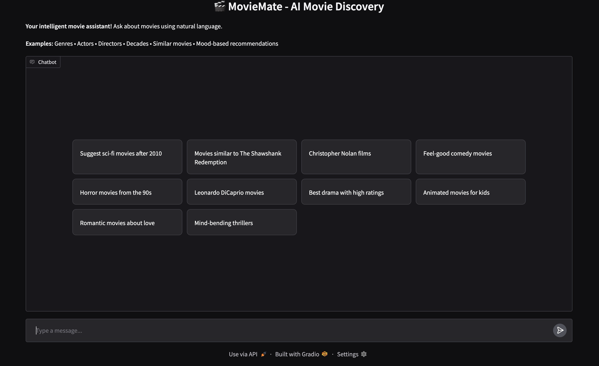
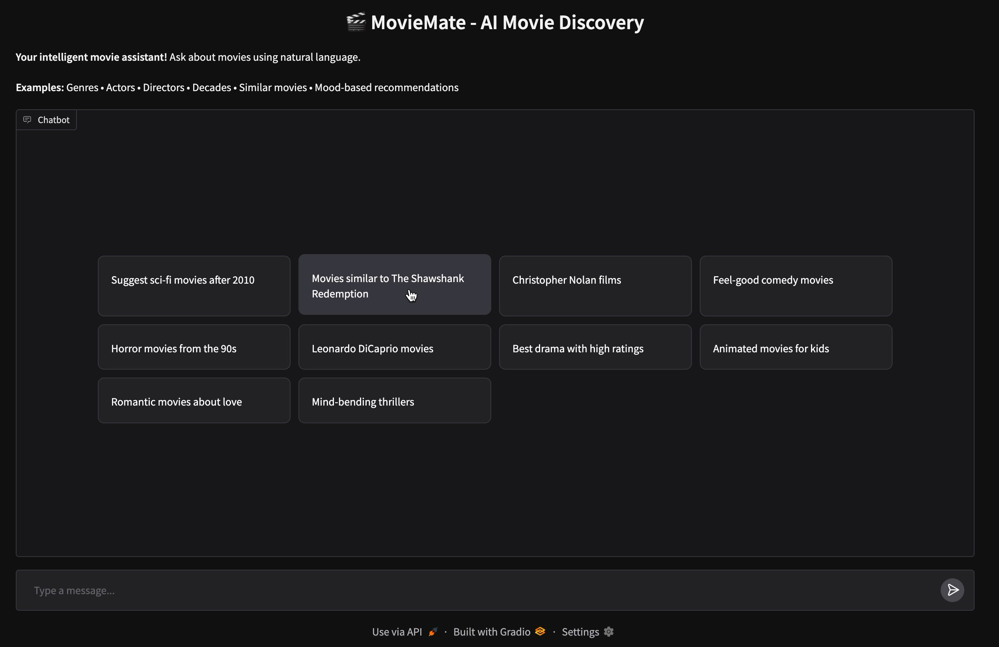
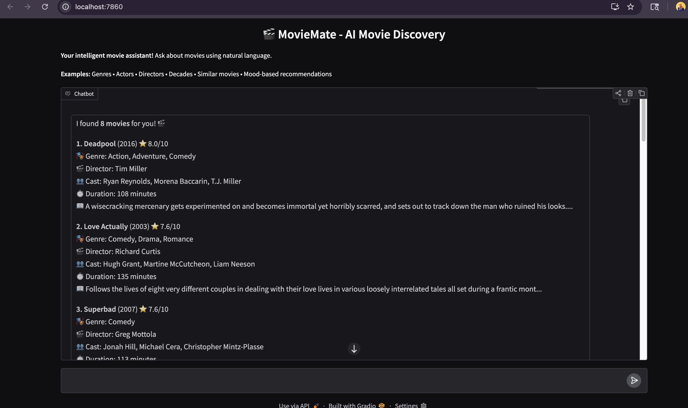
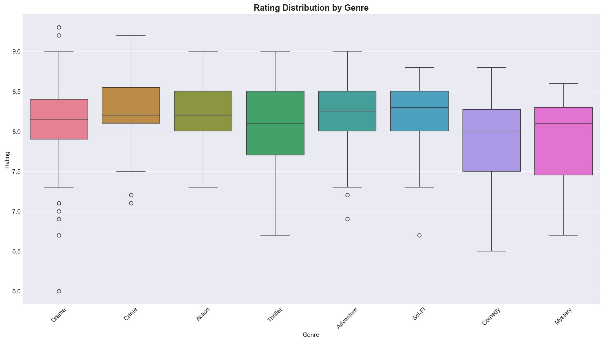
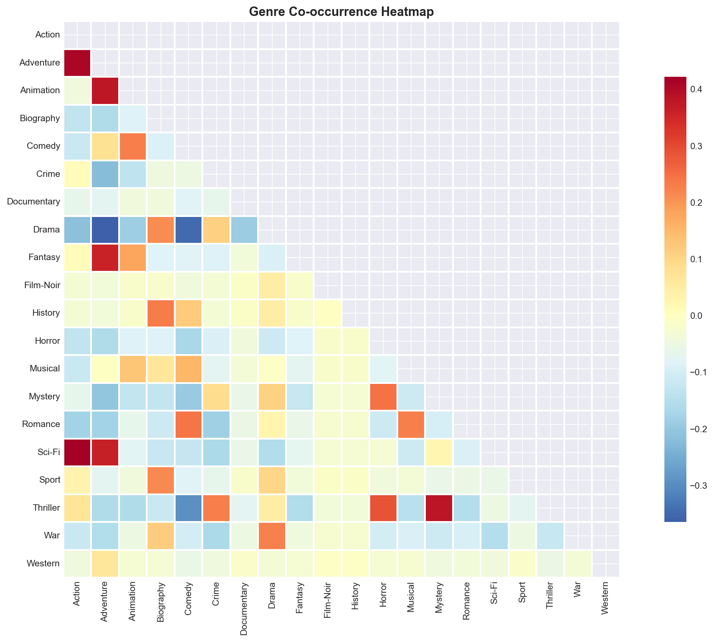
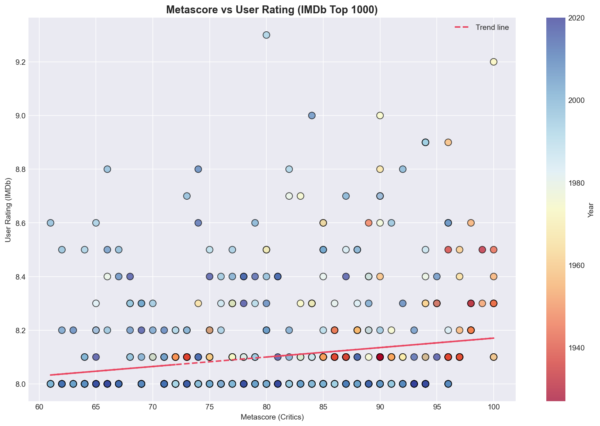
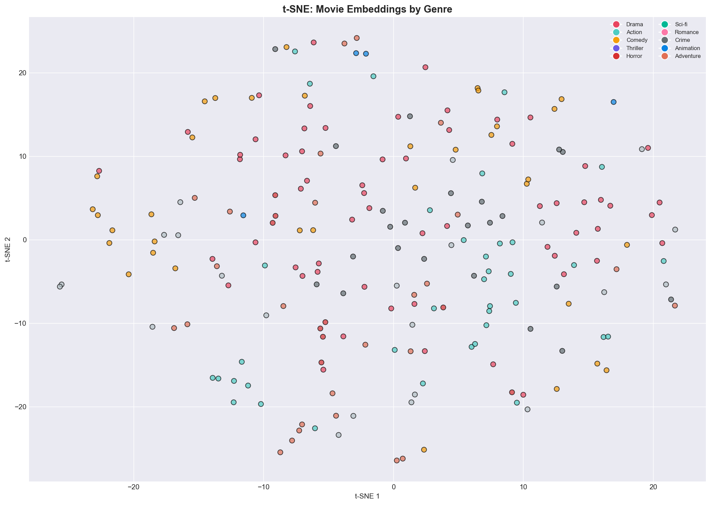

<br>
<p align="center">
  
  
  
  
  
</p>

<p align="center">
  
  
  
</p>

<br>

<p align="center">
  <h1 align="center">🎬 MovieMate</h1>
  <p align="center"><b>AI-Powered Movie Discovery Chatbot</b></p>
  <p align="center">
    Intelligent movie recommendations through natural conversation.<br>
    Powered by <b>Gemini AI</b>, <b>FAISS</b> semantic search, and <b>sentence embeddings</b>.
  </p>
</p>

<br>

---

## 🎥 Demo

<p align="center">
  <i>Chat with MovieMate using natural language — it understands genres, actors, decades, moods, and more.</i>
</p>

### ️ Wireframe Design

<p align="center">
</p>

<p align="center">
  <i>Chat interface layout showing: (1) Header, (2) Chat Area, (3) User Message, (4) Bot Response, (5) Suggestions, (6) Input</i>
</p>

### 🎬 Quick Suggestions Interface

<p align="center">
  
</p>

<p align="center">
  <i>Browse curated movie suggestions with one-click queries like "Suggest sci-fi movies after 2010" or "Christopher Nolan films"</i>
</p>

<p align="center">
  
</p>

<p align="center">
  <i>Interactive buttons with hover effects for better user experience</i>
</p>

### 💬 Live Chat Demo

<p align="center">
  
</p>

<p align="center">
  <i>MovieMate responds with detailed movie information including genre, director, cast, duration, and synopsis</i>
</p>

---

## ✨ Features

| Feature | Description |
|---------|-------------|
| 🤖 **Gemini AI Conversations** | Natural, context-aware responses — not robotic templates |
| 🔍 **Semantic Search** | FAISS vector similarity over 1,000 IMDb movies |
| 💬 **Multi-turn Dialogue** | Remembers conversation history for follow-ups |
| 🎯 **Smart Suggestions** | Dynamic clickable buttons that change per response |
| 📊 **EDA Notebook** | Full exploratory analysis with visualizations |
| ⚡ **Fallback Mode** | Works without API key using rule-based engine |
| 🎭 **Mood Detection** | "Feel-good", "scared", "thoughtful" → genre mapping |

---

## 🏗️ Architecture

<p align="center">
</p>

```
┌─────────────┐     ┌──────────────┐     ┌──────────────┐
│   Gradio    │────▶│  Chatbot     │────▶│  FAISS       │
│   Web UI    │◀────│  Engine      │◀────│  Search      │
└─────────────┘     └──────────────┘     └──────────────┘
                           │
                    ┌──────┴──────
                    ▼             ▼
              ┌──────────┐  ┌──────────┐
              │  Gemini  │  │ Sentence │
              │   API    │  │Transformer│
              └──────────  └──────────┘
```

---

## 🚀 Quick Start

### Option 1: One-Command Setup

```bash
# Clone the repository
git clone https://github.com/yourusername/MovieMate.git
cd MovieMate

# Run setup script
bash scripts/setup.sh

# Start the chatbot
python3 app.py
```

### Option 2: Manual Setup

```bash
# 1. Install dependencies
pip install -r requirements.txt

# 2. Configure Gemini API key
cp .env.example .env
# Edit .env → add your key from https://makersuite.google.com/app/apikey

# 3. Run
python3 app.py
```

Open **[http://localhost:7860](http://localhost:7860)** in your browser.

---

## 💡 Example Queries

<p align="center">
</p>

| Category | Example Query |
|----------|---------------|
| 🎭 Genre | `Suggest sci-fi movies after 2010` |
| 👤 Actor | `Leonardo DiCaprio movies` |
| 🎬 Director | `Christopher Nolan films` |
| 🎯 Similar | `Movies like The Shawshank Redemption` |
| 😊 Mood | `Feel-good comedy movies` |
| 📅 Decade | `Horror movies from the 90s` |
| ⭐ Rating | `Highly rated dramas` |
|  Deep | `Plot of Inception` / `Who directed Interstellar?` |

---

##  Data & Visualizations

<p align="center">
  <b>Exploratory Data Analysis from the Jupyter Notebook</b>
</p>

<table align="center">
  <tr>
    <td align="center"><b>Rating by Genre</b></td>
    <td align="center"><b>Genre Co-occurrence</b></td>
  </tr>
  <tr>
    <td></td>
    <td></td>
  </tr>
  <tr>
    <td align="center"><b>Metascore vs Rating</b></td>
    <td align="center"><b>Embedding t-SNE</b></td>
  </tr>
  <tr>
    <td></td>
    <td></td>
  </tr>
</table>

---

## 📂 Project Structure

```
MovieMate/
├── app.py                      # Main entry point
├── requirements.txt            # Python dependencies
├── .env.example               # API key template
│
├── src/moviemate/             # Source code (modular package)
│   ├── __init__.py
│   ├── chatbot/               # Chatbot logic
│   │   ├── parser.py          # NLU query parser
│   │   ├── gemini_bot.py      # Gemini AI responses
│   │   └── rule_based_bot.py  # Fallback responses
│   ├── search/                # FAISS search engine
│   │   └── __init__.py        # MovieSearchEngine class
│   └── web/                   # Gradio web interface
│       └── app.py             # UI components & layout
│
├── data/embeddings/           # Datasets & pre-computed vectors
│   ├── imdb_top_1000.csv      # Primary dataset (1000 movies)
│   ├── movies.json            # Backup dataset (216 movies)
│   ├── imdb_embeddings.npy    # Vectors for 1000 movies
│   └── movie_embeddings.npy   # Vectors for 216 movies
│
├── notebooks/                  # Jupyter notebooks
│   └── EDA_Analysis.ipynb     # Exploratory data analysis
│
├── assets/                     # Images & media
│   ├── images/plots/          # EDA visualization plots
│   ├── images/screenshots/    # App screenshots
│   ├── images/diagrams/       # Architecture diagrams
│   └── wireframes/            # UI wireframes
│
├── scripts/                    # Utility scripts
│   └── setup.sh               # One-command setup
│
└── docs/                       # Documentation
    └── IMDB ChatBot.pdf       # Project requirements
```

---

## 🔧 Configuration

### Datasets

MovieMate ships with **two datasets** — use whichever works best:

| Dataset | Size | File | Use Case |
|---------|------|------|----------|
| **IMDb Top 1000** | 1,000 movies | `data/embeddings/imdb_top_1000.csv` | Primary — best coverage |
| **Movies JSON** | 216 movies | `data/embeddings/movies.json` | Backup — lightweight |

> Pre-computed embeddings (`.npy` files) are included so you skip the 1-2 min encoding step.

### Gemini API Key

Get a **free** API key:
1. Visit [Google AI Studio](https://makersuite.google.com/app/apikey)
2. Sign in with Google
3. Click **Create API Key**
4. Paste it in `.env`

```env
GEMINI_API_KEY=your_key_here
```

> Without an API key, MovieMate falls back to rule-based responses (still fully functional!).

---

## 🧪 Testing

Try these queries to test the bot:

```
1. "Suggest sci-fi movies after 2010"
2. "Movies similar to The Shawshank Redemption"
3. "Christopher Nolan films"
4. "Tell me about the plot of Inception"
5. "Who directed The Dark Knight?"
6. "More feel-good movies"
7. "Best horror from the 90s"
```

---

## 🛠️ Tech Stack

<p align="center">
  
</p>

| Layer | Technology |
|-------|-----------|
| **Frontend** | [Gradio](https://gradio.app/) — Web chat UI |
| **AI Engine** | [Google Gemini 1.5 Flash](https://ai.google.dev/) |
| **Search** | [FAISS](https://github.com/facebookresearch/faiss) — Vector similarity |
| **Embeddings** | [Sentence Transformers](https://www.sbert.net/) — `all-MiniLM-L6-v2` |
| **Data** | [Pandas](https://pandas.pydata.org/), [NumPy](https://numpy.org/) |
| **Notebook** | [Jupyter](https://jupyter.org/) — EDA & analysis |

---

## 🤝 Contributing

Contributions are welcome! Here's how:

1. **Fork** the repository
2. Create a feature branch: `git checkout -b feature/amazing-feature`
3. Commit changes: `git commit -m "Add amazing feature"`
4. Push: `git push origin feature/amazing-feature`
5. Open a **Pull Request**

---

## 📄 License

This project is licensed under the [MIT License](LICENSE).

---

## 🙏 Acknowledgments

- **Google Gemini** for conversational AI
- **Facebook FAISS** for blazing-fast vector search
- **Sentence Transformers** for semantic embeddings
- **IMDb** for the movie dataset
- **Gradio** for the beautiful web UI

---

<p align="center">
  <b>Made with ❤️ for movie lovers everywhere</b><br>
  <sub>⭐ Star this repo if you found it useful!</sub>
</p>

<br>
